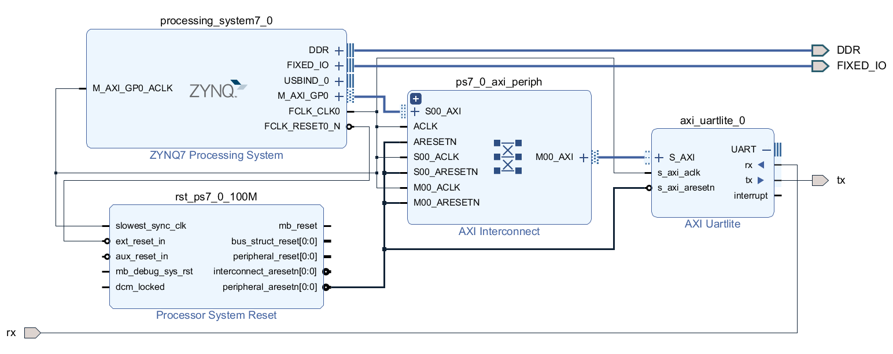

# axi_uartlite_pynq
PYNQ Compatible Python helper functions for AXI UARTLITE IP Core of Xilinx.

## UART Config
`Baud: 9600, RX Pin: PMODA 1, TX Pin: PMODA 2`

## Structure

	bits : Bitstream folder
	img : Image folder
	prj : Vivado project tcl
	src : Source folder (AXI uartlite class)

## Block Diagram

